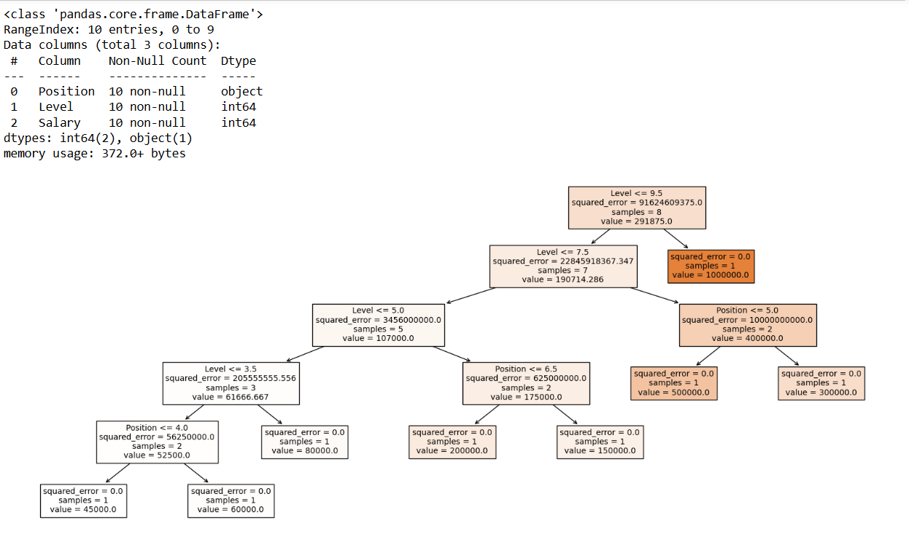

# Implementation-of-Decision-Tree-Regressor-Model-for-Predicting-the-Salary-of-the-Employee

## AIM:
To write a program to implement the Decision Tree Regressor Model for Predicting the Salary of the Employee.

## Equipments Required:
1. Hardware – PCs
2. Anaconda – Python 3.7 Installation / Jupyter notebook

## Algorithm
1. Import the required libraries such as pandas, sklearn, and matplotlib.

2. Load the salary dataset and check for missing values and data types.

3. Encode categorical features and select Position and Level as input features and Salary as the target variable.

4. Split the dataset into training and testing sets and train the Decision Tree Regressor model.

5. Predict the salary, evaluate the model using MSE and R² score, and visualize the decision tree.

## Program:
```
/*
Program to implement the Decision Tree Regressor Model for Predicting the Salary of the Employee.
Developed by: SAI KRIPA SK
RegisterNumber:  212224040284
*/
import pandas as pd

import matplotlib.pyplot as plt

from sklearn.tree import DecisionTreeClassifier, plot_tree

data = pd.read_csv(r"C:/Users/admin/ML/DATASET-20260129/Salary.csv")

data.head()

data.info()

data.isnull().sum()

from sklearn.preprocessing import LabelEncoder

le = LabelEncoder()

data["Position"] = le.fit_transform(data["Position"])

data.head()

x=data[["Position","Level"]]

y=data["Salary"]

from sklearn.model_selection import train_test_split

x_train, x_test, y_train, y_test = train_test_split(x,y,test_size=0.2,random_state=2)

from sklearn.tree import DecisionTreeRegressor,plot_tree

dt=DecisionTreeRegressor()

dt.fit(x_train,y_train)

y_pred=dt.predict(x_test)

from sklearn import metrics

mse = metrics.mean_squared_error(y_test,y_pred)

mse

r2=metrics.r2_score(y_test,y_pred)

r2

dt.predict(pd.DataFrame([[5,6]], columns=x.columns))

plt.figure(figsize=(20, 8))

plot_tree(dt, feature_names=list(x.columns), filled=True)

plt.show()
```

## Output:



## Result:
Thus the program to implement the Decision Tree Regressor Model for Predicting the Salary of the Employee is written and verified using python programming.
